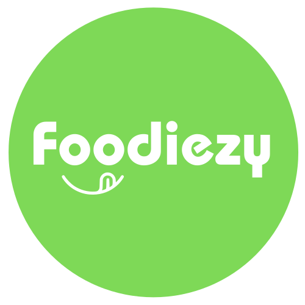

<div align="center" id="top">
  

<a href="https://foodiezy-Web.netlify.app/">Live URL</a>

</div>

<h1 align="center">Foodiezy-Web</h1>
The Food App is a platform where users can browse multiple restaurants, view their menus, add items to their cart, and place orders. The app leverages modern web technologies to provide a seamless user experience.
<br/>
<br/>
<p align="center">
  

  

  

  </p>

  <!--  -->

  <!--  -->

  <!--  -->
</p>

<h4 align="center">
	Foodiezy-Web <sub>beta</sub>
</h4>

<hr>

<p align="center">
  <a href="#dart-about">About</a> &#xa0; | &#xa0;
  <a href="#sparkles-features">Features</a> &#xa0; | &#xa0;
  <a href="#rocket-technologies">Technologies</a> &#xa0; | &#xa0;
  <a href="#white_check_mark-requirements">Requirements</a> &#xa0; | &#xa0;
  <a href="#checkered_flag-starting">Starting</a> &#xa0; | &#xa0;
  <a href="#memo-license">License</a> &#xa0; | &#xa0;
  <a href="https://github.com/Sandeep-morya" target="_blank">Author</a>
</p>

<br>

## :sparkles: Features

- Browse and search restaurants based on various filters.
- View detailed restaurant information including menus.
- Add items to the cart and modify the cart contents
- User authentication using Google authentication.
- GraphQL API for efficient data retrieval.

## :rocket: Technologies

- Frontend: HTML, CSS, Typescript, React.js
- Backend: Node.js, Express.js, GraphQL, Typescript
- Database: MongoDB
- User Authentication: Google OAuth2
- Other Libraries: Apollo Server (for GraphQL), Mongoose (for MongoDB)
- more in package.json

## Future Updates

- Subtotal Price Break
- Checkout Functionlity
- Updated restaurant Facecard
- Updated Chatbot
- Admin Dashboard
- Live Order State Updates

## :white_check_mark: Requirements

Before starting :checkered_flag:, you need to have [Git](https://git-scm.com) and [Node](https://nodejs.org/en/) installed.

## :checkered_flag: Starting

```bash
# Clone this project
$ git clone https://github.com/Sandeep-morya/Foodiezy-Web

# Access
$ cd Foodiezy-Web

# Install dependencies
$ yarn

# Run the project
$ yarn dev

# The server will initialize in the <http://localhost:5000>
```

## :memo: License

This project is under license from MIT. For more details, see the [LICENSE](LICENSE.md) file.

Made with :heart: by <a href="https://github.com/Sandeep-morya" target="_blank">Sandeep Morya</a>

&#xa0;

☺ Feel Free to cotanct for api or to report the bugs

<a href="#top">Back to top</a>
